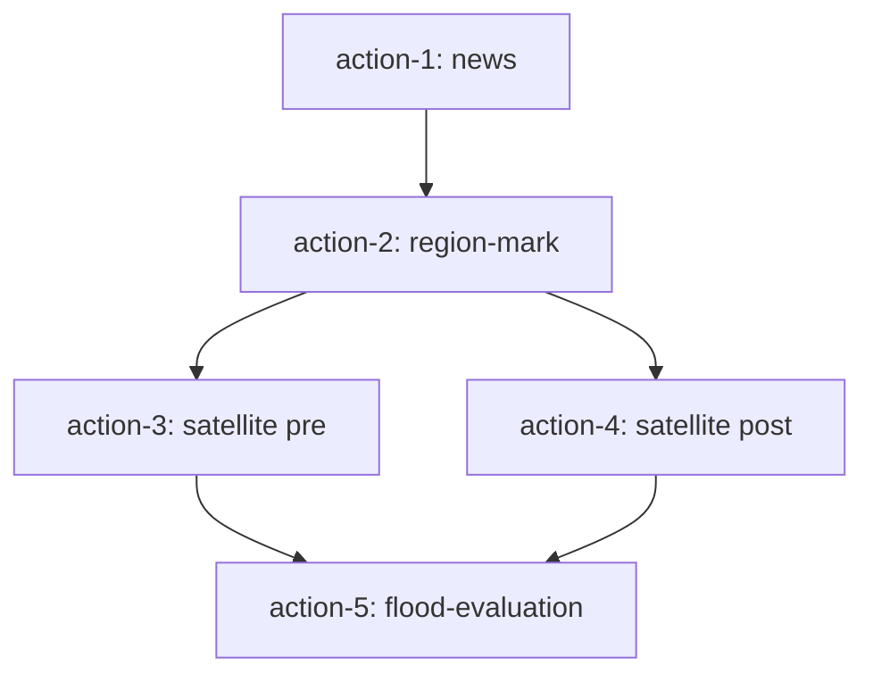

# 湖南石门县暴雨洪涝灾后评估 — 技术实现计划（后端）

## 一、基础信息

| 项 | 内容 |
|---|---|
| 场景名称 | 湖南石门县暴雨洪涝灾后智能评估 |
| 适用平台 | 数智融合智能体应用平台 |
| 涉及系统 | 数智融合智能体应用平台、天基信息服务平台、国家气象信息中心、湖南省气象局、水利部水文信息官网 |
| 核心流程 | 用户提问 → 查询气象/水利官网 → 定位石门县流域 → 获取暴雨前影像 → 提交洪涝应急需求 → 暴雨后影像回调 → 淹没/桥梁/道路损毁评估 → GIS 回显 |
| 核心逻辑 | 用户发起洪涝评估 → 智能体从气象/水利官网抓取权威暴雨信息 → 先调取暴雨前历史影像 → 再提交天基应急需求获取暴雨后影像 → 自动对比完成洪涝评估 |

## 二、5-Action 依赖图



| Action | 类型 | 依赖 | 职责 |
|--------|------|------|------|
| action-1 | news | — | 查询国家气象、湖南省气象局、水利水文官网，获取暴雨权威信息 |
| action-2 | region-mark | action-1 | 定位石门县、澧水/渫水流域及张家渡大桥评估区域 |
| action-3 | satellite | action-2 | 获取天基暴雨前最新历史影像（pre-flood） |
| action-4 | satellite | action-2 | 提报暴雨洪涝应急成像需求（post-flood） |
| action-5 | flood-evaluation | action-3, action-4 | 汇总影像结果，输出淹没/桥梁/道路损毁评估 GIS 数据 |

> action-3 与 action-4 并行执行（均依赖 action-2，彼此无依赖）。

## 三、各 Action 接口契约

### 3.1 action-1: news（暴雨权威信息查询）

**Capability**: `news`
**文件**: `api/src/modules/actions/capabilities/news.ts`

**输入**:
```ts
{
  query: string;  // 用户提问，含"暴雨""石门县""洪涝""灾后评估"等关键词
}
```

**输出**:
```ts
{
  message: string;           // 暴雨基础信息摘要
  summary: {
    overview: string;
    totalFound: number;
    totalReturned: number;
  };
  articles: Array<{
    title: string;
    source: string;
    summary: string;
    relevanceScore: number;
  }>;
}
```

**关键逻辑**: 走 qwen + tavily 实时搜索，提取暴雨时间、强降雨云团位置、渫水超警信息、张家渡大桥损毁事件等权威信息。

---

### 3.2 action-2: region-mark（洪涝评估区域定位）

**Capability**: `region-mark`
**文件**: `api/src/modules/actions/capabilities/region-mark.ts`

**输入**:
```ts
{
  region: "石门县";  // 匹配 REGION_PRESETS 中的石门县 preset（需新增）
}
```

**输出**:
```ts
{
  regionName: string;
  bounds: {
    north: number;
    south: number;
    east: number;
    west: number;
  };
  gisData: {
    type: "region";
    regions: [...];   // 石门县 + 澧水/渫水流域 polygon
    entities: [...];  // 张家渡大桥标记
    cameraView: {...};
  };
}
```

**关键逻辑**: 新增 `REGION_PRESETS` 石门县 preset，坐标 `110.89457167309149, 29.881490688312095`（张家渡大桥）。

---

### 3.3 action-3: satellite pre（暴雨前历史影像）

**Capability**: `satellite`
**文件**: `api/src/modules/actions/capabilities/satellite.ts`

**输入**:
```ts
{
  floodScenario: true;
  phase: "pre";
  region: "石门县";
}
```

**输出**:
```ts
{
  message: string;
  responseType: "pre_flood";
  gisData: {
    type: "entity";
    imageOverlays: [{
      id: "pre-flood-imagery";
      url: "/local-tiles/pre_flood.png";
      rectangle: { west, south, east, north };
      alpha: 0.9;
      tileWidth: 691;
      tileHeight: 502;
      label: "暴雨前影像";
    }];
    cameraView: {...};
  };
}
```

**关键逻辑**: `floodScenario === true && phase === "pre"` 分支，返回 mock 暴雨前影像 overlay。

---

### 3.4 action-4: satellite post（暴雨后应急成像需求）

**Capability**: `satellite`
**文件**: `api/src/modules/actions/capabilities/satellite.ts`

**输入**:
```ts
{
  floodScenario: true;
  phase: "post";
  region: "石门县";
}
```

**输出**:
```ts
{
  message: string;
  responseType: "post_flood";
  gisData: {
    type: "entity";
    imageOverlays: [{
      id: "post-flood-imagery";
      url: "/local-tiles/post_flood.png";  // mock 暴雨后影像
      rectangle: { west, south, east, north };
      alpha: 0.9;
      tileWidth: 691;
      tileHeight: 502;
      label: "暴雨后影像";
    }];
    cameraView: {...};
  };
}
```

**关键逻辑**: `floodScenario === true && phase === "post"` 分支，模拟提报天基洪涝应急需求 + 回调等待，超时后回退到 mock 暴雨后影像。

---

### 3.5 action-5: flood-evaluation（洪涝灾后评估汇总）

**Capability**: `flood-evaluation`
**文件**: `api/src/modules/actions/capabilities/flood-evaluation.ts`（新增）

**输入**: `context`（包含 action-3 和 action-4 的结果）

**Context 解析逻辑**:
```ts
// 遍历 context 所有条目，匹配 responseType
for (const [, value] of contextEntries) {
  const responseType = nestedData?.responseType;  // "pre_flood" | "post_flood"
  const overlays = gisData?.imageOverlays;
  if (responseType === "pre_flood" && overlays?.length) {
    preImageUrl = overlays[0].url;
    preImageRect = overlays[0].rectangle;
  }
  if (responseType === "post_flood" && overlays?.length) {
    postImageUrl = overlays[0].url;
    postImageRect = overlays[0].rectangle;
  }
}
```

**输出**:
```ts
{
  assessmentId: string;    // UUID
  timestamp: string;       // ISO
  summary: {
    location: string;      // "湖南石门县"
    eventTime: string;     // "2026-05-17~05-18"
    dataSource: string;    // "国家气象中心、湖南省气象局、水利水文官网"
    floodedAreaKm2: number;
    bridgesDamaged: number;
    roadsInterrupted: number;
    housesFlooded: number;
  };
  damageZones: Array<{
    level: "severe" | "moderate" | "light";
    name: string;
    areaKm2: number;
    color: string;
    description: string;
  }>;
  gisData: {
    type: "flood";
    imageOverlays: [preOverlay, postOverlay];
    regions: [...];        // 淹没区 polygons（来自 flood.geojson）
    entities: [...];       // 张家渡大桥标记、损毁点
    cameraView: { type: "point", lng, lat, altitude };
    compareMode: "side-by-side";
    compareConfig: {
      leftLabel: "暴雨前影像";
      rightLabel: "暴雨后影像";
      leftOverlayId: "pre-flood-imagery";
      rightOverlayId: "post-flood-imagery";
      damageOverlayIds: string[];
    };
  };
}
```

**关键逻辑**:
1. 运行时读取 `api/flood.geojson` 真实 AI 分析结果（淹没区、桥梁坍塌、道路中断）
2. 失败时回退到 mock `DAMAGE_ZONES`
3. `severity` 映射: high→severe, medium→moderate, low→light
4. `regions` 样式: 蓝色边框（淹没区）或红色边框（损毁区）、无填充
5. `label.position` 支持自定义（`labelPosition`），默认几何中心

---

## 四、数据流转（Context 传递机制）

```
action-3 (satellite pre)
  └── result.data.gisData.imageOverlays[0]
        └── context[action-3-id] = { data: { responseType: "pre_flood", gisData: {...} } }
              └── action-5 解析: preImageUrl, preImageRect

action-4 (satellite post)
  └── result.data.gisData.imageOverlays[0]
        └── context[action-4-id] = { data: { responseType: "post_flood", gisData: {...} } }
              └── action-5 解析: postImageUrl, postImageRect
```

**Context 数据结构**:
```ts
context: {
  [actionId: string]: {
    data: {
      responseType: string;
      gisData?: { imageOverlays: [...] };
    }
  }
}
```

---

## 五、Planner & Router 写死逻辑

### 5.1 Planner
**文件**: `api/src/modules/planner/service.ts`

**洪水关键词检测**:
```ts
const FLOOD_KEYWORDS = ["暴雨", "洪涝", "洪水", "淹没", "石门县", "张家渡"];
```

**Plan 结构**:
```ts
{
  subtasks: [
    { type: "news", params: { query: "..." } },
    { type: "region-mark", params: { region: "石门县" } },
    { type: "satellite", params: { floodScenario: true, phase: "pre", region: "石门县" } },
    { type: "satellite", params: { floodScenario: true, phase: "post", region: "石门县" } },
    { type: "flood-evaluation", params: { region: "石门县" } },
  ];
  finalEvent: { type: "洪涝灾后评估" };
}
```

### 5.2 Router
**文件**: `api/src/modules/router/service.ts`

**Actions 数组**:
```ts
[
  { type: "news", params: { query: "石门县暴雨洪涝", floodScenario: true } },
  { type: "region-mark", params: { region: "石门县" }, dependsOn: ["action-1"] },
  { type: "satellite", params: { floodScenario: true, phase: "pre", region: "石门县" }, dependsOn: ["action-2"] },
  { type: "satellite", params: { floodScenario: true, phase: "post", region: "石门县" }, dependsOn: ["action-2"] },
  { type: "flood-evaluation", dependsOn: ["action-3", "action-4"] },
]
```

---

## 六、关键文件清单（需新增/修改）

| 文件 | 状态 | 职责 |
|------|------|------|
| `api/src/modules/actions/capabilities/flood-evaluation.ts` | **新增** | 洪涝灾后评估 capability（核心） |
| `api/src/modules/actions/capabilities/satellite.ts` | 修改 | 新增 `floodScenario` 分支（pre/post） |
| `api/src/modules/actions/capabilities/region-mark.ts` | 修改 | 新增石门县 preset |
| `api/src/modules/actions/capabilities/news.ts` | 复用 | 新闻/暴雨信息查询 |
| `api/src/modules/planner/service.ts` | 修改 | 新增洪水关键词检测 + plan 生成 |
| `api/src/modules/router/service.ts` | 修改 | 新增洪水 action 生成 |
| `api/src/modules/executor/service.ts` | 修改 | 新增 `flood-evaluation` writeDisplayData case |
| `api/src/modules/actions/registry.ts` | 修改 | 注册 `flood-evaluation` capability |
| `api/flood.geojson` | **新增** | 真实洪涝 AI 分析结果（淹没区、桥梁、道路） |
| `api/public/local-tiles/pre_flood.png` | **新增** | 暴雨前影像 mock |
| `api/public/local-tiles/post_flood.png` | **新增** | 暴雨后影像 mock |

---

## 七、场景核心特点

| 特点 | 说明 |
|------|------|
| 只保留 | 数智融合智能体 + 天基信息服务系统 |
| 任务 1 | 官网查询暴雨权威信息（气象 + 水文） |
| 顺序 | 先暴雨前影像 → 提天基需求 → 后暴雨后影像 |
| 无固定半径 | 评估范围为石门县 + 澧水/渫水流域（结果输出） |
| 纯灾后评估 | 即时服务、一问即办 |
| 真实数据接入 | `flood.geojson` 为真实 AI 分析结果，非纯 mock |
| 分屏对比 | `compareMode: "side-by-side"` 提示前端启用双 viewer |
| 评估维度 | 淹没区、桥梁坍塌、道路中断、房屋受淹（区别于地震的建筑坍塌/山体滑坡） |
